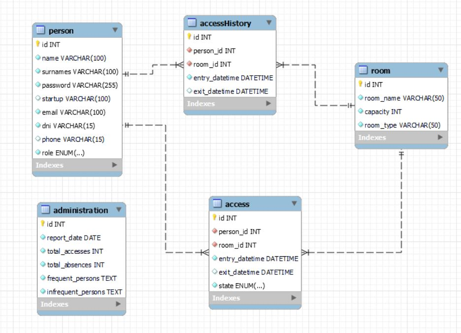

# Naves Coworking Backend🛰️

Welcome to my Naves Backend project, I hope you like it!☄️
<br><br>

</a>

<details>
  <summary>Table of Contents📝</summary>
  <ol>
 <li><a href="#description">Description</a></li>
    <li><a href="#objetive">Objetive</a></li>
    <li><a href="#deploy-">Deploy</a></li>
    <li><a href="#stack">Stack</a></li>
    <li><a href="#database-schema">Database Schema</a></li>
    <li><a href="#local-installation">Local installation</a></li>
    <li><a href="#endpoints">Endpoints</a></li>
    <li><a href="#future-functionalities️">Future functionalities</a></li>
    <li><a href="#development">Development</a></li>
    <li><a href="#appreciations">Appreciations</a></li>
    <li><a href="#contact">Contact</a></li>
  </ol>
</details>
<br>

## Description📚
This project consists of transforming the management of a coworking space into a fluid and automated experience. Through an innovative application, the aim is to optimize access control, facilitating the real-time registration of user entries and exits. In addition, the tool will allow you to manage work room reservations and offer accurate administrative reports for more efficient decision making. All this, in an intuitive and easy-to-use environment, designed to modernize the administration of these collaborative spaces.

## Objetive🎯
Develop a comprehensive platform for managing access and room reservations that facilitates the efficient administration of spaces, guaranteeing a fluid experience for users.

This system will allow users to register their accesses, make reservations, and consult their activity history, while administrators will be able to generate detailed reports and statistics on the use of the rooms. Through an intuitive interface and robust functionalities, it seeks to optimize the use of available resources, improve organization and provide a safe and accessible environment for all users.


- **Efficiency:** Reduce the time and effort necessary to manage access and reservations.
- **Transparency:** Provide a clear history of accesses and reservations for users and administrators.
- **Data Analysis:** Allow administrators to make informed decisions based on usage statistics.
- **Security:** Ensure that only authorized users have access to the rooms.

<p align="center">

</p>

## Deploy 🚀
<div align="center">
    <a href=""><strong> Click here! </strong></a>🚀🚀🚀
</div>

## Stack📒
Used technology:
<div align="center">
<a>
    
</a>
<a>
    
</a>
<a>
    
</a>
<a>
    
</a>
<a>
    
</a>
<a>

</a>
<a>
    
</a>
<a>
    
</a>
</div>


## Database Schema📋


    - Person - Access: A person can have multiple accesses. One to one relationship many.

    - Room - Access: A room can have multiple entrances. One to many relationship.

    - Person - Access_History: A person can have multiple access records access history. One to many relationship.

    - Room - Access_History: A room can have multiple access history records access. One to many relationship.

    - Access - Access_History: Each access generates a record in the access history access. One to one relationship.

## Local installation🧾
1. Install docker and create a mysql container
1. Clone the repository
2.  ``` $ npm install  ```
3. We connect our repository with the database
4. ``` $ npm run dev ``` 
5. ``` $ We execute the migrations $ npm run migrate ``` 
6. ``` $ We run the seeders $ npm run db:seed ``` 
7. ...


## Endpoints🧩
 Admin user: david@david.com
<details>
<summary>Authentication🔑</summary>

- **Register user** <br>Registers a new user with email and password. This endpoint allows new users to create an account in the system.<br>

          POST http://localhost:4000/api/auth/register

    body:

    ```js
        {
            "email": "david@david.com",
            "password": "123456789",
            "name": "David",
            "surnames": "Fernandez",
            "dni": "123456789B",
            "phone": "53227372",
            "startup": "Juncos"
        }
    ```

<br>

- **Login user**  <br>Logs in an existing user and returns an authentication token. This token is used for accessing protected endpoints.<br>	

          POST http://localhost:4000/api/auth/login

    body:

    ```js
        {
            "email": "david@david.com",
            "password": "123456789"
        }
    ```
</details>
<details>
<summary>Access📅</summary>

- **Entry** <br>Records a user's entry into a specific room. This endpoint requires authentication and the room ID.<br>	

          POST http://localhost:4000/api/accesses/entry

    body:

    ```js
        {
            "room_id": "5"
        }
    ```

    auth:

    ```js
        auth token
    ```

<br>

- **Exit** <br>Records a user's exit from a specific room. This endpoint requires authentication and the room ID.<br>	

          POST http://localhost:4000/api/accesses/exit

    body:

    ```js
        {
            "room_id": "5"
        }
    ```

    auth:

    ```js
        auth token
    ```

<br>

- **Reserve** <br>Allows a user to reserve a room for a specific date and time. This endpoint requires authentication, room ID, and entry datetime.<br>

          POST http://localhost:4000/api/accesses/reserve

    body:

    ```js
        {
            "room_id": "5",
            "entry_datetime": "2024-09-30 23:00:00"
        }
    ```

    auth:

    ```js
        auth token
    ```

<br>

- **Cancel reserve** <br>Cancels an existing reservation. This endpoint requires the reservation ID and authentication.<br>

          PUT http://localhost:4000/api/accesses/reservations/:id

    auth:

    ```js
        auth token
    ```

<br>

- **Current occupants** <br>Retrieves the list of current occupants in a specific room. This endpoint requires the room ID and authentication.<br>

          GET http://localhost:4000/api/accesses/current/room/:id

    auth:

    ```js
        auth token
    ```
</details>
<details>
<summary>Persons🧑🏻</summary>

- **Current access** <br>Retrieves information about a specific person's current access. This endpoint requires the person's ID and authentication.<br>

          GET http://localhost:4000/api/persons/:id/current-access

    auth:

    ```js
        auth token
    ```

<br>

- **Access history** <br>Retrieves the access history of a specific person. This endpoint requires the person's ID and authentication.<br>


          GET http://localhost:4000/api/persons/:id/access-history

    auth:

    ```js
        auth token
    ```

</details>
<details>
<summary>Room🏠</summary>

- **Current access** <br>Retrieves the current status of a specific room, including current occupants. This endpoint requires the room ID and authentication.<br>


          GET http://localhost:4000/api/rooms/:id/current-status

    auth:

    ```js
        auth token
    ```


</details>
<details>
<summary>Access history📓</summary> <br>Retrieves the access history for all rooms within a specific date range. This endpoint requires authentication and date parameters.<br>

- **Access history**

          GET http://localhost:4000/api/access_histories

    body:

    ```js
        {
            "start_date": "2024-09-01",
            "end_date": "2024-09-30"
        }
    ```

    auth:

    ```js
        auth token
    ```
<br>

- **Access history room** <br>Retrieves the access history for a specific room within a date range. This endpoint requires the room ID, authentication, and date parameters.<br>

          GET http://localhost:4000/api/access_histories/room/:id

    body:

    ```js
        {
            "start_date": "2024-09-01",
            "end_date": "2024-09-30"
        }
    ```

    auth:

    ```js
        auth token
    ```

</details>
<details>
<summary>Administration📝</summary> 

- **Daily report** (IS ADMIN) <br>Generates a daily report of room usage. This endpoint is restricted to admin users and requires authentication.<br>

          POST http://localhost:4000/api/administration/daily-report

    auth:

    ```js
        auth token
    ```
<br>

- **Report** (IS ADMIN) <br>Generates a custom report of room usage for a specific date range. This endpoint is restricted to admin users and requires authentication and date parameters.<br>

          GET http://localhost:4000/api/administration/reports

    body:

    ```js
        {
            "start_date": "2024-09-01 00:00:00",
            "end_date": "2024-10-30 00:00:00"
        }
    ```

    auth:

    ```js
        auth token
    ```
<br>

- **Room statistics** (IS ADMIN) <br>Retrieves usage statistics for all rooms. This endpoint is restricted to admin users and requires authentication.<br>

          GET http://localhost:4000/api/administration/room-usage

    auth:

    ```js
        auth token
    ```

</details>


## Future functionalities⏭️
- Internal social network or chat for networking
- Advanced access control with facial or fingerprint recognition
- ...


## Development👨🏻‍💻

```js
const developer = "DavidFernandez";

console.log("Developed by: " DavidFernandez);
```

## Appreciations💯

I would like to dedicate my thanks to the teachers at Geeks Hubs as well as my day to day peers with whom we can help each other with our problems.


## Contact📲
- **David Fernandez Valle**
  - [GitHub](https://github.com/Davfernandezz)
  - [Linkedin](https://www.linkedin.com/in/david-fern%C3%A1ndez-valle-1b4461300/?originalSubdomain=es)
